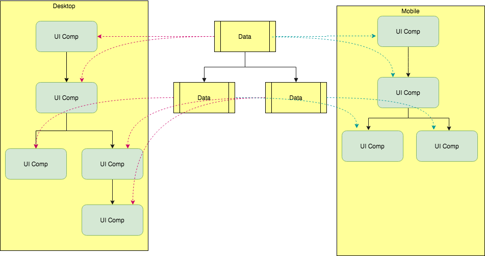

Demo: 
TODO Sandbox - https://codesandbox.io/s/03mmpx513p
Source For Sample App - https://github.com/deepakpatil84/pure-data-todo
# PureData
Scalable,Reusable,Simple and Predictable state management
[](https://travis-ci.org/deepakpatil84/pure-data)
[](https://coveralls.io/github/deepakpatil84/pure-data?branch=master)


### Prerequisites
You should have basic understanding of front end application architectures. Not must but if you know Flux,Redux or MobX that will help to evaluate to PureData. Knowledge of typescript will also help in understanding and developing PureData applications.

## Thoughts
An experience front end architect will create the architecture with following expectations
* Predictability
* Maintainability
* Flexibility
* Adaptability
* Stability

One thing to note here is these are expectations from your application architecture not from framework your are using(e.g. AngularJS, ReactJS, VueJS etc). We should use tools/libraries to achieve these expectations.

### Introduction
PureData helps you to keep data separate from ui logic in order to keep it Pure. Consider you want to write application targeting three platforms desktop,tablet and phone. To start with sign-up screen may look totally different on phone than desktop version. But it will be dealing with same data like email,username,password etc and operations like signUP and verify for example. So it is very much possible that we can write separate class only for data part for sign-up and write three separate UI classes for each platform which will consume the same data class across the platforms.

Thats good. But here is the real advantage.
Now imagine if your desktop sign-up has additional field like 'location', you don't need to write the data class from scratch just extend the SignUp data for desktop and add that field, and you are done without need to update other UI classes.

Apart from above these PureData guarantees the *best possible performance* by controlling the render flow of application.



### Implementation

To start all you need understand **Data** and **Component**.

#### Data ####
To encapsulate data which will get consumed by Component class (UI Class).
```
import * as PureData from 'pure-data'
export default class TabData extends PureData.Data {
    email: string = 'user@mail.com'
    username: string = 'user'
    password: string = ';
}
```

**Methods**
*set*: set the values to properties

Note: following methods mostly used internally, but available for special use
*on* - to get callback on any change to data
*off* - to remove the change callback
*triggerUpdate* - to trigger update cycle
*setModified* - to mark this data as modified this will schedule the update cycle asychronously

#### Component ####

Components consume *Data* . Render will be called on data updates. You can update the data by calling *set* function.
Data can be accessed through props in component. Also Component can have state and additional properties.
```

import * as PureData from 'pure-data'
import * as React from 'react'
import TabData from './Tab.data'


export default class Tab extends PureData.Component<TabData>{
    constructor(props: any, context: any) {
        super(props, context)
        this.handleChange = this.handleChange.bind(this)
    }
    handleChange(){
        this.props.data.set({username:'new_user'})
    }
    render() {
        let data = this.props.data;
        return <div>
            <div>Email : {data.email}</div>
            <div>Username : {data.username}</div>
            <div>Password : {data.password}</div>
            <button onClick={this.handleChange}>Change</button>
        </div>
    }
}
```

#### Root Component ####
You will need a root component to control re-rendering of application, its a standard react component which host the PureData.Component
```
import AppData from './App.data'
//App is a PureData component
import App from './App'
import { HashRouter } from 'react-router-dom'
import * as React from 'react'
let appData: AppData = new AppData();

export default class Root extends React.PureComponent {
    private waitingForMoreUpdates = false;
    constructor(props: any, context: any) {
        super(props, context)
        this.onDataUpdate = this.onDataUpdate.bind(this)
    }
    onDataUpdate() {
        if (this.waitingForMoreUpdates == false) {
            this.waitingForMoreUpdates = true
            setTimeout(() => {
                this.forceUpdate()
                this.waitingForMoreUpdates = false
            }, 5)
        }
    }
    render() {
        return <HashRouter>
            <App parent={null} data={appData} onUpdate={this.onDataUpdate} />
        </HashRouter>
    }
}
```

#### ComponentWithRoutes ####
Any component which hold routes should use PureData.ComponentWithRoutes instead of PureData.Component.
Only difference is takes router.route.pathname into account for rendering


### Installing
```
npm install --save pure-data
```


